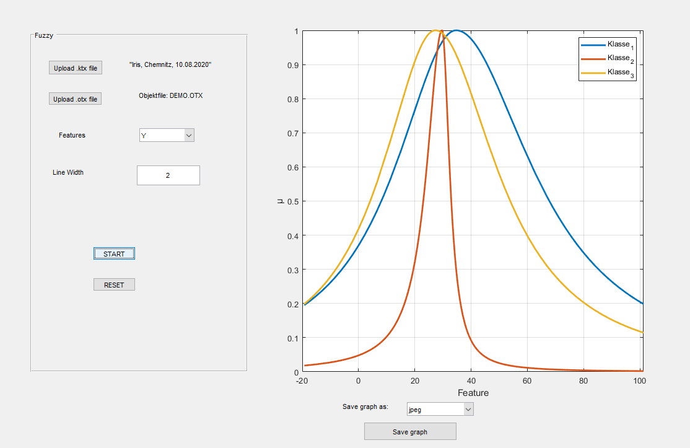

# COVID-Data-Visualisation
Trying to visulaize COVID data

## Part of work I have been doing.
1. Upload .ktx file and .otx file
2. Hit 'Start' to see the graph for all class and membership value (µ)
3. Go over other feature to see changes
4. Save it in your project directory.

##This is how it looks like

